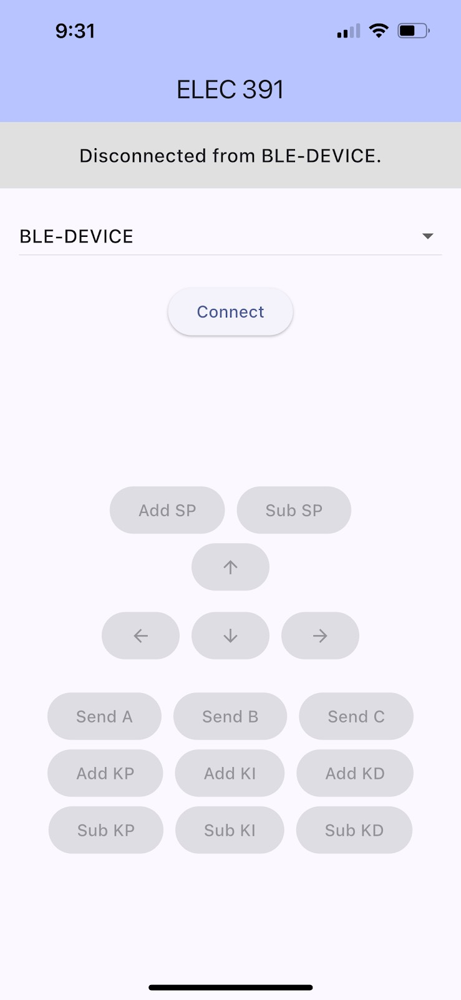

# Two-Wheel Self-Balancing Robot (UBC ELEC 391)

A two-wheeled **self-balancing robot** designed and built as part of UBC ELEC 391. The project explored the challenge of controlling an inherently unstable, dynamic system using real-time feedback control, Bluetooth communication, and embedded software.

## Features
- **Arduino Nano 33 BLE Sense Rev2** as main MCU (onboard IMU + BLE)
- **Sensor fusion** with Kalman filter (accelerometer + gyroscope)
- **PID control loop** for tilt stabilization
- **Dual DRV8833 H-bridge drivers** + Pololu DC motors
- **BLE interface** for commands (FORWARD, BACKWARD, LEFT, RIGHT, BALANCE, STOP)
- Successfully balanced, drove straight, executed 45° turns, and ascended/descended a 15° ramp

## Robot 

## Flutter App 

## Control Approach
- **Kalman Filter** dynamically combines noisy accelerometer data with drifting gyro integration for reliable tilt estimation.
- **PID Control** adjusts motor PWM to correct tilt error in real-time.
- **BLE Commands** set robot state:
  - `"BALANCE"`: maintain upright posture
  - `"FORWARD"` / `"BACKWARD"`: lean setpoint adjustment for motion
  - `"LEFT"` / `"RIGHT"`: spin by counter-rotating wheels
- **Mode Switching**: tuned PID values differ for stationary balancing vs. moving.

## Results
- Balanced in place for **>30 seconds** with <±3 cm oscillation
- Drove forward/backward ≥50 cm at 10 cm/s without falling
- Completed 45° turns within 2 seconds
- Climbed and descended a 15° incline while maintaining balance

## Future Improvements
- Integrate **wheel encoders** for closed-loop velocity control
- Develop a more accurate **dynamic model** for model-based control
- Refine turning algorithm for smoother maneuvering

## Credits
Course: **UBC ELEC 391** • Team Project (Summer 2025)  
Team Members: Sophia Cockram, Tara Rouhbakhsh Mirabi, Katherine Santiago